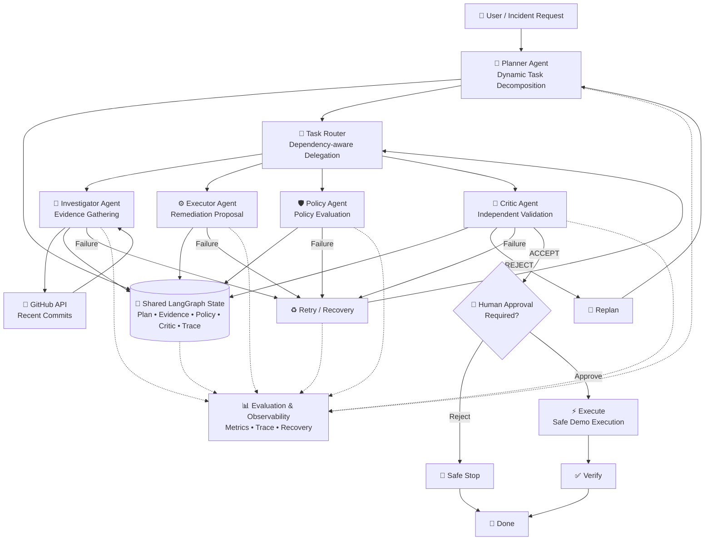

 CURRENTLY USED IN STREAMLIT FOR TIME CONSTRAINT (REACT USE IN FUTURE)


# 🛡️ Sentinel AI — Multi-Agent Incident Resolution System

> **P-03: Multi-Agent Systems — Systems That Plan, Delegate and Recover**

Sentinel AI is a safety-first, enterprise incident-resolution system built with **LangGraph, LangChain and Gemini**.

It demonstrates a real multi-agent architecture where an LLM **plans work dynamically, delegates tasks to specialised agents, gathers external evidence, proposes remediation, checks policy, performs independent critique, recovers through retry/replanning, and requires human approval before sensitive execution**.

---

## 🚀 Problem

Enterprise incidents often require more than a single LLM response.

A useful incident-resolution system needs to:

- investigate real evidence
- decide which specialised capabilities are required
- coordinate multiple agents
- keep track of dependencies
- handle failed or degraded steps
- challenge its own proposed solution
- enforce organisational policy
- stop before irreversible actions
- provide a human-auditable trace of what happened

Sentinel AI is designed around these requirements.

---

# 🏗️ System Architecture



---

## 🔄 Core Workflow

```text
User Request
     │
     ▼
┌─────────────┐
│   Planner   │
│ Dynamic Plan│
└──────┬──────┘
       ▼
┌─────────────┐
│ Task Router │
└──────┬──────┘
       │
       ├──────────────► Investigator ───► GitHub API
       │                     │
       │                     ▼
       │                  Evidence
       │
       ├──────────────► Executor
       │                     │
       │                     ▼
       │              Remediation Proposal
       │
       ├──────────────► Policy
       │                     │
       │                     ▼
       │              Policy Evaluation
       │
       └──────────────► Critic
                             │
                     ┌───────┴────────┐
                     │                │
                   REJECT           ACCEPT
                     │                │
                     ▼                ▼
                  REPLAN       Human Approval
                     │                │
                     └──► Planner     ├── Reject → Safe Stop
                                      │
                                      └── Approve
                                            │
                                            ▼
                                         Execute
                                            │
                                            ▼
                                         Verify
                                            │
                                            ▼
                                           DONE
```

---

# 🤖 Agents

## 1. 🧠 Planner Agent

The Planner is responsible for **reasoning about the work**, not executing it.

Responsibilities:

- understand the incident
- decompose the problem into meaningful tasks
- select specialised agents
- create task dependencies
- select implemented tools when required
- explain why each task is necessary
- incorporate Critic feedback during replanning
- avoid creating fake or unnecessary tasks

The plan is generated as structured output rather than a hardcoded sequence.

Example task structure:

```json
{
  "id": 1,
  "description": "Retrieve recent repository changes",
  "agent": "investigator",
  "reason": "Gather evidence about recent changes",
  "depends_on": [],
  "requires_tool": true,
  "tool": "get_recent_commits",
  "tool_arguments": {
    "repo": "owner/repository",
    "per_page": 20
  }
}
```

---

## 2. 🔀 Task Router

The Task Router acts as the execution coordinator.

It:

- finds unfinished tasks
- checks dependencies
- selects the appropriate specialised agent
- records routing decisions
- prevents tasks from executing before their prerequisites are complete

This makes delegation **dependency-aware** instead of simply calling agents in a fixed order.

---

## 3. 🔎 Investigator Agent

The Investigator gathers and analyses evidence.

Current external integration:

**GitHub REST API**

```text
Repository
    ↓
GitHub API
    ↓
Recent commits
    ↓
Evidence
    ↓
LLM analysis
```

The Investigator is explicitly instructed to distinguish:

- observed facts
- inference
- hypotheses
- missing information

It must not fabricate logs, metrics, telemetry or root causes.

---

## 4. ⚙️ Executor Agent

The Executor prepares a remediation proposal.

It identifies:

- target component
- proposed action
- expected benefit
- risks
- reversibility
- side effects
- verification requirements

### Important

The Executor does **not** directly perform sensitive production changes.

It creates a proposal that must pass:

```text
Policy → Critic → Human Approval
```

before execution.

---

## 5. 🛡️ Policy Agent

The Policy Agent evaluates the proposed remediation against the enterprise incident-response policy.

Example policy principles include:

- production changes require explicit human approval
- destructive or irreversible actions cannot execute automatically
- remediation must be evidence-backed
- insufficient evidence should result in diagnostic/read-only actions
- security-sensitive changes require review
- proposed changes should preferably be reversible
- agents must never claim execution before execution occurs

These are **demo enterprise policies**, not universal rules.

---

## 6. 🧐 Critic Agent

The Critic independently reviews:

- investigation evidence
- proposed remediation
- policy evaluation
- operational risk
- reversibility
- missing information

It returns:

```text
ACCEPT
```

or

```text
REJECT
```

A rejection does not simply terminate the system.

Instead:

```text
Critic
  ↓
REJECT
  ↓
Replan
  ↓
Planner
  ↓
New task graph
```

This creates an actual recovery loop.

---

# 🧠 Shared State

LangGraph maintains shared workflow state containing information such as:

```text
user_request
repository
incident
plan
current_task
completed_tasks
retrieved_context
sources
tool_calls
tool_results
policy_result
critic_decision
critic_feedback
retry_count
replan_count
step_count
max_steps
proposed_action
requires_human_approval
approval_status
approved
execution_result
verification_result
status
final_response
trace
```

This allows agents to communicate through a controlled shared state instead of relying only on conversational messages.

---

# 🔁 Recovery & Fault Tolerance

Sentinel AI is designed to recover from failures.

## Retry

If a specialised agent fails:

```text
Agent Failure
     ↓
Retry Counter
     ↓
Retry
     ↓
Agent
```

Retries are bounded.

## Replanning

If the Critic rejects the remediation:

```text
Critic REJECT
     ↓
Replan
     ↓
Planner
     ↓
New Plan
```

The Planner receives the Critic's feedback and is instructed to address the identified problems rather than blindly repeat the previous plan.

## Safe Stop

If the system exceeds recovery limits or encounters an unsafe/unknown state:

```text
Failure
  ↓
Limit Reached
  ↓
SAFE STOP
```

---

# 👤 Human-in-the-Loop Safety

Sensitive actions are never automatically executed.

The workflow pauses at:

```text
Critic ACCEPT
      ↓
Human Approval
```

The human sees:

- proposed action
- policy evaluation
- critic feedback
- risks
- reversibility
- approval requirement

The workflow can then resume with:

```text
Approve → Execute → Verify
```

or:

```text
Reject → Safe Stop
```

LangGraph's interrupt/checkpoint mechanism is used to pause and resume the workflow.

---

# 🧰 Tool Integration

## GitHub REST API

The system currently integrates a real external API:

```text
GET /repos/{owner}/{repo}/commits
```

The tool handles:

- valid responses
- non-200 responses
- timeout failures
- request failures
- malformed/unexpected response formats
- repository URL normalization

Example supported input:

```text
owner/repository
```

or:

```text
https://github.com/owner/repository
```

The returned commit data is converted into structured evidence for the Investigator.

---

# 🤖 Model Fallback

Sentinel AI supports Gemini model fallback.

Current configuration:

```text
Primary:
gemini-3.1-flash-lite

Fallback:
gemini-2.5-flash-lite
gemini-3.5-flash-lite
```

If a model invocation fails, the model layer attempts the next configured model.

This applies to both:

- normal LLM calls
- structured-output calls

The model response layer also normalizes Gemini response content so downstream agents receive predictable text.

---

# 🧭 Graph-Level Control

The workflow is implemented with LangGraph.

Conceptually:

```text
START
  ↓
Planner
  ↓
Task Router
  ↓
Specialised Agent
  ↓
Task Router
  ↓
...
  ↓
Critic
  ├── Reject → Replan → Planner
  └── Accept → Human Approval
                    ├── Reject → Safe Stop
                    └── Approve → Execute → Verify → END
```

The graph also contains bounded:

- retry paths
- replan paths
- safe-stop paths
- human approval interruption
- verification stage

---

# 📊 Observability & Evaluation

Sentinel AI exposes an **Agent Evaluation & Observability** dashboard.

It tracks observable execution signals such as:

### Agent-level

- Planner actions
- Investigator actions
- Executor actions
- Policy checks
- Critic validation
- Human approval state
- Verification state

### System-level

- total agent actions
- successful actions
- failed actions
- tool attempts
- tool success rate
- evidence items
- completed tasks
- retries
- replans
- workflow steps
- configured step limit
- safety violations

### Audit Trace

Every important workflow action records:

```text
Agent
Action
Input
Reason
Status
Model Used
Retry Count
Replan Count
```

This makes the system human-auditable rather than a black-box chain of LLM calls.

> The evaluation dashboard reports observable system behaviour and workflow signals. It is not presented as a fabricated model-accuracy benchmark.

---

# 🛡️ Safety Design

Sentinel AI follows a defense-in-depth approach:

```text
Evidence
   ↓
Remediation Proposal
   ↓
Policy Evaluation
   ↓
Independent Critic
   ↓
Human Approval
   ↓
Execution
   ↓
Verification
```

No single LLM output is treated as sufficient authority for a sensitive action.

The system also enforces:

- bounded retries
- bounded replanning
- maximum workflow steps
- explicit approval
- safe stop
- evidence-grounded reasoning
- execution-state tracking
- human-readable trace

---

# 📁 Project Structure

```text
SENTINAL-AI/
│
├── agents/
│   ├── planner.py
│   ├── investigator.py
│   ├── executor.py
│   ├── policy.py
│   └── critic.py
│
├── graph/
│   ├── state.py
│   ├── router.py
│   └── workflow.py
│
├── tools/
│   └── github.py
│
├── app.py
├── main.py
├── models.py
├── config.py
├── requirements.txt
├── .env
├── .gitignore
└── README.md
```

---

# ⚙️ Tech Stack

| Technology | Purpose |
|---|---|
| Python | Core application |
| LangGraph | Stateful multi-agent orchestration |
| LangChain | LLM integration and agent components |
| Gemini | LLM reasoning |
| Pydantic | Structured planner output |
| GitHub REST API | Real external evidence source |
| Streamlit | Interactive control center |
| dotenv | Environment configuration |

---

# 🔐 Environment Setup

Create a `.env` file:

```env
GOOGLE_API_KEY=your_google_api_key
```

Do **not** commit `.env`.

Recommended `.gitignore`:

```gitignore
.env
.venv/
__pycache__/
*.pyc
.streamlit/secrets.toml
```

---

# ▶️ Run Locally

Install dependencies:

```bash
uv sync
```

or:

```bash
pip install -r requirements.txt
```

Run the Streamlit application:

```bash
streamlit run app.py
```

Run the CLI workflow:

```bash
uv run python main.py
```

---

# 🧪 Example Incident

### Input

```text
Our payment service started experiencing failures after a recent deployment.

Investigate what changed, determine the likely cause, prepare a remediation
action, check whether the proposed remediation complies with company policy,
and validate the remediation before execution.

Do not perform any irreversible action without human approval.
```

### Example generated task graph

```text
Task 1
Investigator
└── Retrieve recent repository commits

Task 2
Investigator
└── Analyse collected evidence
    depends_on: Task 1

Task 3
Executor
└── Prepare remediation
    depends_on: Task 2

Task 4
Policy
└── Evaluate remediation
    depends_on: Task 3

Task 5
Critic
└── Independently validate proposal
    depends_on: Task 4

Human Approval
└── Required before execution
```

The exact plan is generated dynamically by the Planner and can change based on the incident and Critic feedback.

---

# 🎯 Why This Is a Real Multi-Agent System

Sentinel AI is not simply:

```text
Prompt → LLM → Answer
```

and it is not merely a fixed:

```text
Agent A → Agent B → Agent C
```

Instead:

```text
                    ┌──────────────┐
                    │    Planner   │
                    └──────┬───────┘
                           │
                    Dynamic Plan
                           │
                    ┌──────▼───────┐
                    │ Task Router  │
                    └──────┬───────┘
                           │
             ┌─────────────┼─────────────┐
             ▼             ▼             ▼
        Investigator   Executor       Policy
             │             │             │
             └─────────────┼─────────────┘
                           ▼
                        Critic
                       /     \
                  REJECT     ACCEPT
                    │          │
                  Replan     Human
                    │       Approval
                    │        /   \
                    │     Reject  Approve
                    │       │       │
                    │   Safe Stop  Execute
                    │               │
                    └──────────── Verify
                                      │
                                      ▼
                                     DONE
```

The system demonstrates:

- **planning**
- **delegation**
- **specialisation**
- **shared state**
- **tool use**
- **dependency management**
- **independent critique**
- **recovery**
- **replanning**
- **human-in-the-loop**
- **bounded execution**
- **observability**

---

# 🏆 Hackathon Requirement Mapping

| Requirement | Sentinel AI Implementation |
|---|---|
| More than one agent | Planner, Investigator, Executor, Policy, Critic |
| Real planning | Planner dynamically generates structured task graph |
| Delegation | Dependency-aware Task Router |
| External tool/API | GitHub REST API |
| Actual response handling | Structured parsing + error/format handling |
| Failure recovery | Retry + fallback models + safe stop |
| Replanning | Critic rejection → Planner |
| Human-auditable trace | Agent/action/reason/input/status trace |
| Stopping condition | Maximum workflow steps + retry/replan limits |
| Human approval | Interrupt before sensitive execution |
| Shared memory/state | LangGraph AgentState + checkpointing |
| Tool uncertainty | Planner selects only implemented tools |
| Critic | Independent validation before approval |
| Metrics | Agent/system observability dashboard |

---

# 🧠 Design Principles

### 1. Plan before acting

The Planner decides what work is required instead of forcing every incident through the same fixed sequence.

### 2. Evidence before remediation

The system gathers available evidence before proposing a corrective action.

### 3. Proposal before execution

The Executor prepares an action but does not directly perform sensitive changes.

### 4. Independent validation

The Critic provides a separate quality gate before human approval.

### 5. Humans retain control

Sensitive actions require explicit human approval.

### 6. Failure is a workflow state

Failures trigger retry, replan, degradation or safe stop instead of silently disappearing.

### 7. Everything important is observable

The system records why an action happened, what agent performed it and what happened afterward.

---

# 🔮 Future Improvements

Possible production extensions:

- Kubernetes read-only diagnostics
- Prometheus/Grafana metrics
- Jira/ServiceNow incident integration
- Slack/Teams notifications
- deployment and CI/CD integrations
- vector memory for historical incidents
- learned tool selection
- cost-aware planning
- latency-aware routing
- persistent PostgreSQL checkpointer
- OpenTelemetry tracing
- human approval through Slack/Teams
- real reversible rollback execution
- automated regression/evaluation datasets

---

# 👨‍💻 Author

Built as a hackathon project demonstrating **multi-agent orchestration, planning, delegation, recovery, safety controls and observability** with LangGraph and Gemini.

---

## ⭐ Key Takeaway

**Sentinel AI turns incident resolution into a controlled multi-agent workflow rather than a single LLM response.**

> **Plan → Delegate → Investigate → Propose → Check Policy → Critique → Approve → Execute → Verify**

with:

> **Retry → Replan → Safe Stop**

when things go wrong.
